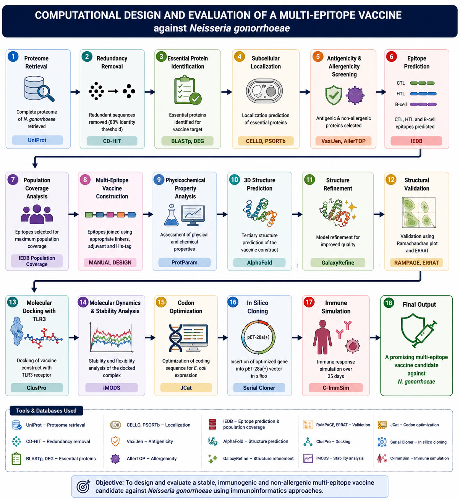
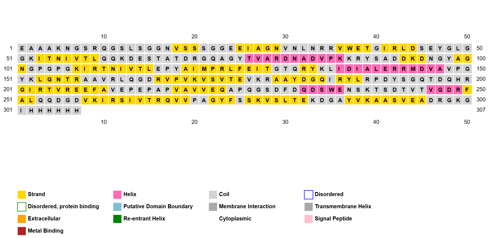
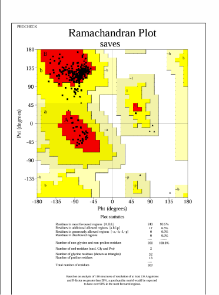
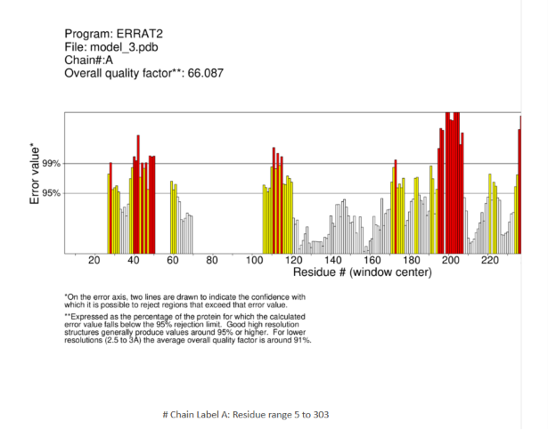
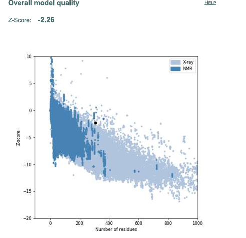
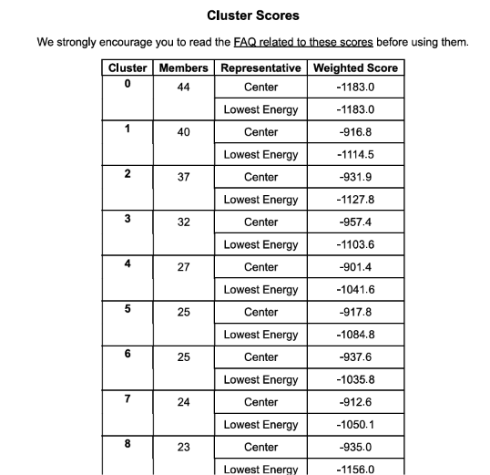

# 🧬 Multi-Epitope Vaccine Design Against *Neisseria gonorrhoeae*

## Project Overview

This repository documents my undergraduate research project focused on the computational design and evaluation of a multi-epitope vaccine candidate against *Neisseria gonorrhoeae* using reverse vaccinology and immunoinformatics approaches.

The project integrates bioinformatics, structural biology, and computational immunology to identify promising vaccine candidates through an in silico workflow.

---

## Research Objectives

- Identify potential vaccine targets from the pathogen proteome.
- Predict immunogenic B-cell and T-cell epitopes.
- Design a multi-epitope vaccine construct.
- Evaluate structural quality and stability.
- Assess the vaccine candidate using computational validation techniques.

---

## 🧭 Computational Workflow

*Figure 1. Computational workflow illustrating the reverse vaccinology and immunoinformatics pipeline used for the computational design and evaluation of a multi-epitope vaccine candidate against* **Neisseria gonorrhoeae**.

---

## 🔬 Research Methodology

The computational workflow followed a reverse vaccinology and immunoinformatics pipeline consisting of the following stages:

1. Retrieval of the complete proteome of *Neisseria gonorrhoeae* from UniProt.
2. Removal of redundant protein sequences using CD-HIT.
3. Identification of essential proteins.
4. Prediction of subcellular localization.
5. Screening for antigenicity and allergenicity.
6. Prediction of CTL, HTL, and B-cell epitopes.
7. Population coverage analysis using the IEDB Population Coverage tool.
8. Construction of a multi-epitope vaccine using AAY, GPGPG, and EAAAK linkers.
9. Evaluation of physicochemical properties.
10. Three-dimensional structure prediction.
11. Structure refinement.
12. Structural validation.
13. Molecular docking with Toll-like receptor 3 (TLR3).
14. Molecular dynamics and stability analysis using iMODS.
15. Codon optimization using JCat.
16. In silico cloning into the pET-28a(+) expression vector using Serial Cloner.
17. Immune simulation using C-ImmSim.

---

| Category | Tools |
|----------|-------|
| Protein Database | UniProt |
| Redundancy Removal | CD-HIT |
| Essential Protein Analysis | DEG |
| Subcellular Localization | PSORTb, CELLO |
| Antigenicity Prediction | VaxiJen |
| Allergenicity Prediction | AllerTOP |
| Epitope Prediction | IEDB Analysis Resource |
| Population Coverage | IEDB Population Coverage |
| Structure Prediction | AlphaFold |
| Structure Refinement | GalaxyRefine |
| Structure Validation | PROCHECK (Ramachandran Plot), ERRAT |
| Molecular Docking | ClusPro |
| Molecular Dynamics | Desmond (400 ns) |
| Flexibility Analysis | iMODS |
| Codon Optimization | JCat |
| In Silico Cloning | Serial Cloner |
| Immune Simulation | C-ImmSim |

---
## 📊 Results and Validation

### 🧬 Secondary Structure Prediction

Secondary structure analysis was performed to evaluate the structural composition of the designed multi-epitope vaccine construct, including α-helices, β-sheets, and coil regions.

  

*Figure 2. Secondary structure prediction of the designed multi-epitope vaccine construct.*

---

### 🧪 Ramachandran Plot Analysis

The refined vaccine model was evaluated using Ramachandran plot analysis to assess stereochemical quality and residue distribution within favored, allowed, and disallowed regions.

  

*Figure 3. Ramachandran plot analysis of the refined vaccine construct showing residue distribution in different conformational regions.*

---

### 📈 ERRAT Structural Quality Assessment

ERRAT analysis was performed to evaluate the overall quality of the refined three-dimensional vaccine structure based on non-bonded atomic interactions.

  

*Figure 4. ERRAT plot showing the overall structural quality assessment of the refined vaccine model.*

---

### 🧫 ProSA Model Validation

ProSA analysis was carried out to evaluate the overall reliability of the predicted vaccine structure by comparing its Z-score with experimentally determined protein structures.

  

*Figure 5. ProSA validation plot showing the quality assessment of the predicted vaccine structure.*

---

### 🔗 Molecular Docking Analysis

Molecular docking was performed to evaluate the interaction between the designed vaccine construct and Toll-like receptor 3 (TLR3).

  

*Figure 6. Molecular docking visualization showing the interaction between the vaccine construct and TLR3 receptor.*

---

### ⚙️ Molecular Dynamics Simulation

Molecular dynamics simulation was performed to investigate the stability, flexibility, and dynamic behavior of the vaccine–TLR3 complex.

  

  

*Figure 7. Molecular dynamics simulation results demonstrating the stability and structural behavior of the vaccine–TLR3 complex.*

---

### 🧠 Immune Simulation Analysis

Immune simulation was performed using C-ImmSim to predict the potential cellular and humoral immune responses generated by the designed vaccine construct.

  

  

*Figure 8. Immune simulation results showing predicted immune response profiles following vaccine administration.*
## 📊 Key Results

### 📊 Key Results

| Parameter | Result |
|-----------|--------|
| Vaccine Construct Length | 354 amino acids |
| Optimized Coding Sequence | 936 bp |
| Allergenicity | Non-allergenic |
| Solubility | Soluble |
| Ramachandran Plot | 93.5% residues in most favored regions (98.0% favored after refinement) |
| ERRAT Quality Score | 66.087% |
| Best Docking Score (TLR3) | -1183.0 |
| Molecular Dynamics Analysis | Stable vaccine–TLR3 complex supported by iMODS |
| Immune Simulation | Strong immune response with antigen clearance by Day 5 |
| Peak IFN-γ Response | ~420,000 ng/mL (Day 10) |
| Codon Adaptation Index (CAI) | Improved from 0.7325 to 0.9574 |
| GC Content | Improved from 64.93% to 70.36% |

---

### Highlights

- Successfully designed a computational multi-epitope vaccine candidate against *Neisseria gonorrhoeae*.
- Predicted vaccine construct was non-allergenic and soluble.
- Structural refinement improved model quality before docking.
- Molecular docking demonstrated favorable interaction with TLR3.
- iMODS analysis suggested a stable vaccine–receptor complex.
- Immune simulation predicted robust humoral and cellular immune responses.
- Codon optimization improved the construct for potential expression in *Escherichia coli*.

  ---

## 📚 References

1. UniProt Consortium. UniProt: the Universal Protein Knowledgebase.
2. The IEDB Consortium. Immune Epitope Database and Analysis Resource.
3. Jumper et al. Highly accurate protein structure prediction with AlphaFold.
4. Waterhouse et al. SWISS-MODEL: homology modelling of protein structures.
5. Wiederstein M, Sippl MJ. ProSA-web: interactive web service for protein structure analysis.
6. Colovos C, Yeates TO. Verification of protein structures: patterns of nonbonded atomic interactions.
7. Sturniolo et al. Generation and validation of T-cell epitope predictions.

---

## 👨‍🔬 Author

**Rohail Ahmad**  
B.S. Biotechnology | Researcher in Immunoinformatics & Computational Vaccine Design

### Research Interests

- Reverse vaccinology
- Multi-epitope vaccine design
- Immunoinformatics
- Computational biology
- Structural bioinformatics

### Contact

- GitHub: https://github.com/ruhait28282-dot
- LinkedIn: www.linkedin.com/in/rohail-ahmed-81b079377
- Email: ruhait28282@gmail.com
